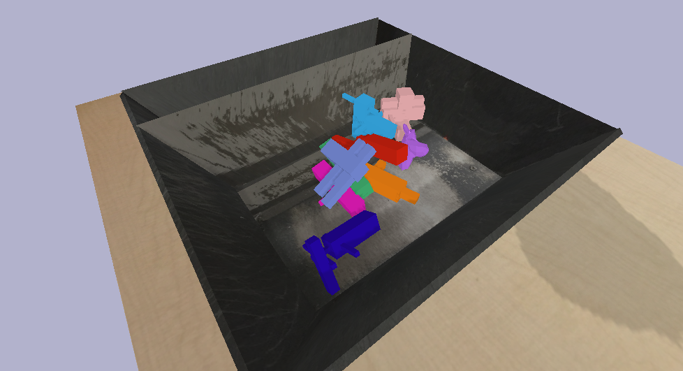

# procedural generation of objects for bullet grasping



## generate .obj files

we generate and export `.obj` files within blender

start `blender` under this directory

open blender console (ctrl-alt-w, shift-f4) and run generation script

```
f = "gen_objs.py"
exec(compile(open(f).read(),f,'exec'))
generate_n_objects(n=10, output_dir="objs")
```

##  run convex decomposition

exported `.objs` are concave only so need to run a convex decomposition on
meshes. we'll use `vhacd` to do this.

```
cd ~/dev
git clone git@github.com:kmammou/v-hacd.git
cd v-hacd/install
python3 run.py --cmake
```

which builds the binary `$HOME/dev/v-hacd/build/linux/test/testVHACD`

we can run vhacd on all exported `.obj` files to make a corresponding `.vhacd.obj` file.

`.obj` are used for visual mesh, `.vhacd.obj` are used for collision.

```
# note: this script assumes path to testVHACD
./run_vhacd.sh objs
```

## create urdfs

to load objects into bullet we need to generate `.urdf` files.
use the bullet example `data/cube.udf` as a template

```
./gen_urdfs.py objs
```
